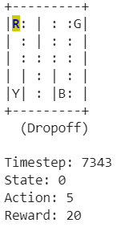

# Reinforcement Q-Learning with OpenAI Gym

## Table of Contents

[Objective](#1)

[Overview](#2)

- [Problem Statement](#3)

- [Information Engineering](#4)

- [Algorithm Design](#5)

- [Evaluation](#6)

[Main Steps](#7)

[Usage](#8)

- [Install](#9)

- [Environment States](#10)

[Brute Force Technique](#11)

[Train and Evaluate](#12)

- [Tune alpha, gamma, and epsilon using decay over episodes](#13)

- [Use the Grid Search](#14)

[Reference](#15)

## <a name = "1">Objective</a>

The project was part of my AI & Data Science Master's degree at the University of Ottawa. 

Kaggle link: [Link](https://www.kaggle.com/code/mostafanofal/reinforcement-q-learning-with-openai-gym)

Check all the projects here: [Link](https://github.com/Mostafanofal453)

## <a name = "2">Overview</a>

### <a name = "3">Problem Statement</a>

We are dealing with the Atari environment from the GYM library and try to optimize the agent actions with Reinforcement Learning. There are 4 locations (labeled by different letters), and our job is to pick up the passenger at one location and drop him off at another. We receive +20 points for a successful drop-off and lose 1 point for every time-step it takes. There is also a 10 points penalty for illegal pick-up and drop-off actions.


Blue and purple letters indicate the current pick-up and destination respectively.


[ // ]: # "![image]&#40;https://drive.google.com/uc?export=view&id=1aEcVPm_zLV8cAX3p6yXGr5LRvGhIVlrW;"

### <a name = "4">Information Engineering</a>

Action Space representation: 

- 0 = south 

- 1 = north 

- 2 = east 

- 3 = west 

- 4 = pickup 

- 5 = drop-off 

- Action Space Discrete (6)

Now we have (4+1 passenger locations, 4 destinations), so the State Space Discrete will be 5 x 5 x 5 x 4 = 500 states


Additional Rules:

- Rewards: successful drop-off 

- Penalized if it tries to drop off in wrong locations 

- Not making it to the destination after every time-step. ["Slight" negative because we would prefer our agent to reach late instead of making wrong moves trying to reach to the destination as fast as possible]

### <a name = "5">Algorithm Design</a>

Q-Learning:


[ // ]: # "![image]&#40;https://drive.google.com/uc?export=view&id=1yGtWeRXQ2BXgQaCzTJzhrrjcvGVrzTva;"


[ // ]: # "![image]&#40;https://drive.google.com/uc?export=view&id=1SqAIP9ocoaOPVDvfFkoQ4adDUiMmKClo;"

### <a name = "6">Evaluation</a>


[ // ]: # "![image]&#40;https://drive.google.com/uc?export=view&id=1VFntT4zKCt0tcFErU7XFPP3cS0F4eZSk;"

## <a name = "7">Main Steps</a>

 So, the project is divided into four modules:

1) Build a modular code consisting of functions that can be used to run the environment.
2) Try the Brute Force technique
3) Tune alpha, gamma, and epsilon using decay over episodes.
4) Implement a grid search to discover the best hyperparameters.

## <a name = "8">Usage</a>
### <a name = "9">Install </a>
All we have to do to run the environment is to install these lines of code
```python
!pip install cmake 'gym[atari]' scipy
!pip install gym[atari]
!pip install autorom[accept-rom-license]
!pip install gym[atari,accept-rom-license]==0.21.0
```
We just need to pass the environment name to the train model function.
```python
env = environment("Taxi-v3")
```

### <a name = "10">Environment States</a>

```python
env_states_actions(env)
```

Output:


[ // ]: # "![image]&#40;https://drive.google.com/uc?export=view&id=1Bni-EXdStRePPoZcgdsiW7QB-BuRX6wn;"

## <a name = "11">Brute Force Technique</a>

```python
epochs,penalties, frames = brute_force(env)

print("Timesteps taken: {}".format(epochs))
print("Penalties incurred: {}".format(penalties))

"""" Output:
Timesteps taken: 7343
Penalties incurred: 2489
""""
```

The print frames function is to moniter and show every iteration of the process.

```python
print_frames(frames)
```



[ // ]: # "![image]&#40;https://drive.google.com/uc?export=view&id=1MpIArnyVb6er0hZ6uAX3hNOjHsnjWCBm;"

## <a name = "12">Train and Evaluate</a>

### <a name = "13">Tune alpha, gamma, and epsilon using decay over episodes</a>

```python
# The hyperparameters
alpha = 0.9
gamma = 0.9
epsilon = 0.9
```
```python
q_tables = training_decay(env)

""" Output:
Episode: 100000
Training finished.
"""
```
```python
evaluation(env, q_tables, 1000)

""" Output:
Number of q_table: 1
Results after 1000 episodes:
Average timesteps per episode: 13.041
Average penalties per episode: 0.0
"""
```

### <a name = "14">Use the Grid Search</a>

Grid Search is used to find the best combinations of hyper parameters values and to get the minimum penalty and minimum steptime.

```python
alphalist = [0.5, 0.9]
gammalist = [0.5, 0.9]
epsilonlist = [0.5, 0.9]

hyperp_comb = hyperp_comb(alphalist, gammalist, epsilonlist)
print(hyperp_comb)

""" Output:
[(0.5, 0.5, 0.5), (0.5, 0.5, 0.9), (0.5, 0.9, 0.5), (0.5, 0.9, 0.9), (0.9, 0.5, 0.5), (0.9, 0.5, 0.9), (0.9, 0.9, 0.5), (0.9, 0.9, 0.9)]
"""
```

```python
q_tables = training_grid(env, hyperp_comb)

""" Output:
Episode: 100000
Training finished.
"""
```

```python
len(q_tables)

""" Output Number of tables:
8  
"""
```

```python
evaluation(env, q_tables, 1000)

""" Output:
Number of q_table: 1
Results after 1000 episodes:
Average timesteps per episode: 13.1
Average penalties per episode: 0.0
Number of q_table: 2
Results after 1000 episodes:
Average timesteps per episode: 26.129
Average penalties per episode: 0.0
Number of q_table: 3
Results after 1000 episodes:
Average timesteps per episode: 39.277
Average penalties per episode: 0.0
Number of q_table: 4
Results after 1000 episodes:
Average timesteps per episode: 52.414
Average penalties per episode: 0.0
Number of q_table: 5
Results after 1000 episodes:
Average timesteps per episode: 65.497
Average penalties per episode: 0.0
Number of q_table: 6
Results after 1000 episodes:
Average timesteps per episode: 78.624
Average penalties per episode: 0.0
Number of q_table: 7
Results after 1000 episodes:
Average timesteps per episode: 91.778
Average penalties per episode: 0.0
Number of q_table: 8
Results after 1000 episodes:
Average timesteps per episode: 105.037
Average penalties per episode: 0.0
"""
```

## <a name = "15">Reference</a>

https://www.learndatasci.com/tutorials/reinforcement-q-learning-scratch-python-openai-gym/